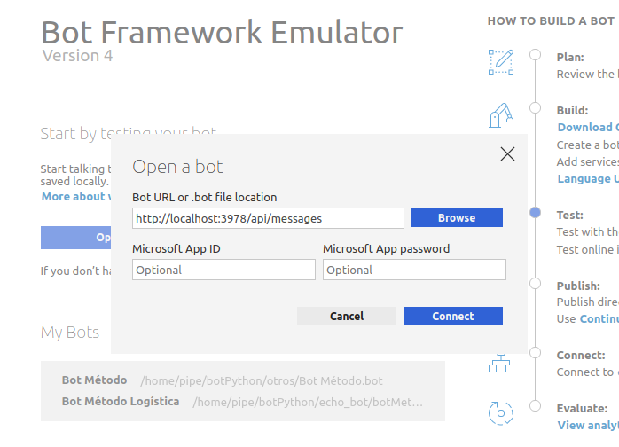
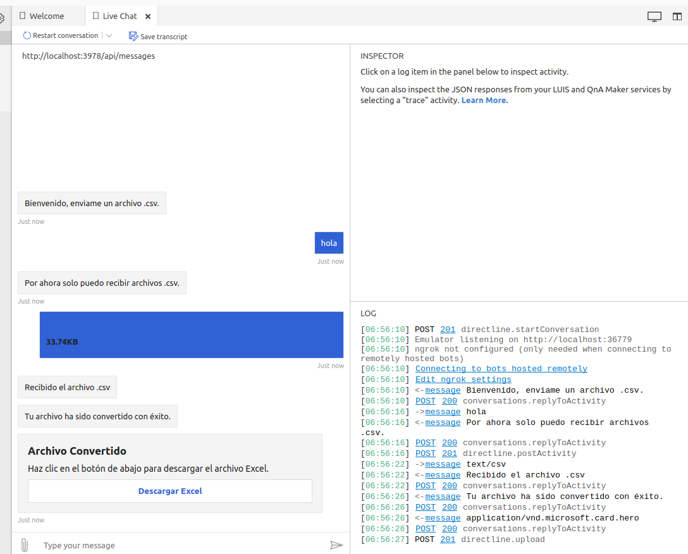

# Creación

## Overview
Este bot está diseñado para facilitar la conversión de archivos .csv a .xlsx con un solo clic, integrándose directamente en el entorno de Microsoft Teams.

## Requisitos Previos
1. **Python**: Necesitarás Python 3.10 o superior para ejecutar el bot. Puedes descargarlo desde [python.org](https://www.python.org/downloads/).

2. **Microsoft Teams**: Deberás tener acceso a Microsoft Teams, donde se integrará y utilizará el bot. Puedes ingresar desde [microsoft-teams.com](https://www.microsoft.com/es-cl/microsoft-teams/log-in)


3. **ConvertAPI**: Esta API se emplea para convertir archivos CSV a Excel rápidamente. Puedes registrarte en [convertapi.com](https://www.convertapi.com/csv-to-xlsx#snippet=python)

4. **Echo Bot**: El `Echo Bot` es un bot de ejemplo de `Microsoft Bot Framework` que sirve como punto de partida para construir el bot. 

5. **Bot Framework Emulator**: Es necesario para probar localmente tu bot y asegurar interacciones fluidas con el usuario. Puedes descargarlo en [Bot Framework Emulator](https://github.com/Microsoft/BotFramework-Emulator/releases/tag/v4.3.3)

6. **Azure**: Se utiliza Azure para hospedar el bot. Puedes registrarte en [azure.com](https://azure.microsoft.com/es-es/)


7. **Developer Portal**: Utilizarás el Developer Portal de Microsoft para gestionar y desplegar tu aplicación de bot en Teams.


## Instalacion

### ConvertAPI

- Ingresa a [convertapi.com](https://www.convertapi.com/csv-to-xlsx#snippet=python) registrate y ve a Perfil>Authentication y copia tu API Secret (la necesitarás en el siguiente paso).

### Echo Bot


- Clonar el repositorio de BotBuilder Samples de Microsoft con el siguiente comando:

```
git clone https://github.com/microsoft/BotBuilder-Samples.git
```
```
cd BotBuilder-Samples/samples/python/02.echo-bot
```

- Copia en el archivo `requirements.txt` el siguiente contenido:
```
aiohttp  
python-dotenv
botbuilder-core
botbuilder-schema
convertapi
```

- Instala las librerias con:
```
pip install -r requirements.txt
```

- Crea un archivo .env con la variable `API_SECRET` y en ella asigna la API de `convertapi.com`


Ejemplo: 
```
API_SECRET=123
```
- Abrir archivo `echo_bot.py`
- El codigo a reemplazar ya contiene el uso de la `API_SECRET` para la variable de entorno
- Reemplaza su contenido por el siguiente:

#### Codigo a reemplazar 
```python
from botbuilder.core import ActivityHandler, TurnContext, MessageFactory
from botbuilder.schema import AttachmentData, ChannelAccount, Attachment, CardAction, ActionTypes, HeroCard
from dotenv import load_dotenv
import os
import aiohttp
import convertapi
load_dotenv()

# Configura tu clave secreta de ConvertAPI
convertapi.api_secret = os.getenv("API_SECRET")

class MyBot(ActivityHandler):

    async def on_message_activity(self, turn_context: TurnContext):
        print("on_message_activity")
        if turn_context.activity.attachments and len(turn_context.activity.attachments) > 0:
            attachment = turn_context.activity.attachments[0]
            if attachment.content_type == "text/csv":
                await turn_context.send_activity("Recibido el archivo .csv")
                await self.process_csv_attachment(attachment, turn_context)
            else:
                await turn_context.send_activity("Por favor, envíame un archivo .csv.")
        else:
            await turn_context.send_activity("Por ahora solo puedo recibir archivos .csv.")

    async def convert_csv_to_xlsx(self, local_csv_path):
        print("convert_csv_to_xlsx")
        # Hacer la solicitud a ConvertAPI y obtener el resultado
        conversion_result = convertapi.convert(
            'xlsx', {
                'File': local_csv_path,
                'Delimiter': ','
            },
            from_format='csv'
        )
        
        print("Archivo convertido: " + conversion_result.file.url)
        return conversion_result.file.url

    async def download_file(self, url):
        print("download_file")
        async with aiohttp  .ClientSession() as session:
            async with session.get(url) as response:
                if response.status == 200:
                    file_path = 'downloads/' + url.split('/')[-1]
                    with open(file_path, 'wb') as f:
                        f.write(await response.read())
                    return file_path

    async def _download_attachment_and_save(self, attachment: AttachmentData):
        print("_download_attachment_and_save")
        # Comprobar si el directorio de descargas existe, si no, crearlo
        download_folder = "downloads"
        if not os.path.exists(download_folder):
            os.makedirs(download_folder)

        # Extraer el nombre del archivo del URL
        file_name = attachment.name if attachment.name else attachment.content_url.split("/")[-1]
        file_path = os.path.join(download_folder, file_name)

        # Descargar el archivo
        async with aiohttp.ClientSession() as session:
            async with session.get(attachment.content_url) as response:
                if response.status == 200:
                    with open(file_path, "wb") as file:
                        file.write(await response.read())

        return file_path

    async def _send_excel_file(self, turn_context: TurnContext, file_url: str, file_name: str):
        # Crear una tarjeta con un botón de descarga
        print("_send_excel_file")
        card = HeroCard(
            title="Archivo Convertido",
            subtitle="Haz clic en el botón de abajo para descargar el archivo Excel.",
            buttons=[CardAction(
                type=ActionTypes.open_url,
                title="Descargar Excel",
                value=file_url
            )]
        )

        attachment = Attachment(
            content_type="application/vnd.microsoft.card.hero",
            content=card
        )

        await turn_context.send_activity(MessageFactory.attachment(attachment))

    async def on_members_added_activity(self, members_added: ChannelAccount, turn_context: TurnContext):
        print("on_members_added_activity")
        for member_added in members_added:
            if member_added.id != turn_context.activity.recipient.id:
                await turn_context.send_activity("Bienvenido, enviame un archivo .csv.")

    async def process_csv_attachment(self, attachment: AttachmentData, turn_context: TurnContext):
        print("process_csv_attachment")

        local_csv_path = await self._download_attachment_and_save(attachment)
        xlsx_url = await self.convert_csv_to_xlsx(local_csv_path)
        print("Archivo convertido: " + xlsx_url)

        if xlsx_url:
            local_xlsx_path = await self.download_file(xlsx_url)
            await turn_context.send_activity("Tu archivo ha sido convertido con éxito.")
            await self._send_excel_file(turn_context, xlsx_url, "converted.xlsx")
        else:
            await turn_context.send_activity("Hubo un problema al convertir el archivo, intenta de nuevo.")
```

### Bot Framework Emulator

Descarga la versión que se adecue a tu sistema operativo, desde el sitio [Bot Framework Emulator](https://github.com/Microsoft/BotFramework-Emulator/releases/tag/v4.3.3).

Para trabajar con el Bot Framework Emulator en diferentes sistemas operativos, sigue las instrucciones específicas para cada uno.

#### Windows

- Ejecuta el instalador y sigue las instrucciones.
***

#### Ubuntu
Otorga permisos de ejecución
```
chmod 700 BotFramework-Emulator-4.3.3-linux-x86_64.AppImage
```
Ejecuta Bot Framework Emulator

```
./BotFramework-Emulator-4.3.3-linux-x86_64.AppImage &
```
***

#### Mac
1. Una vez descargado, localiza el archivo `.dmg` en tu carpeta de descargas y ábrelo con un doble clic.
2. Arrastra el icono del Bot Framework Emulator a tu carpeta de Aplicaciones para instalarlo.
3. Abre el emulador desde la carpeta de Aplicaciones.

***

Una vez abierto, verás una pantalla como esta:


### Ejecutar Bot Framework Emulator

- Haga click en `Open Bot`


- Ahora volvemos a nuestro `echo bot`. Ingresamos a la carpeta `BotBuilder-Samples/samples/python/02.echo-bot`
y ejecutamos el bot con el siguiente comando:
```
python3 app.py
```
Una vez ejecutado, verás una pantalla como esta:


- Volvemos a `Bot Framework Emulator` y en Bot URL, ingresar la URL anterior con el sufijo indicado y Conectar.



- Una vez conectado, ya puedes interactuar con el Bot de manera local.


