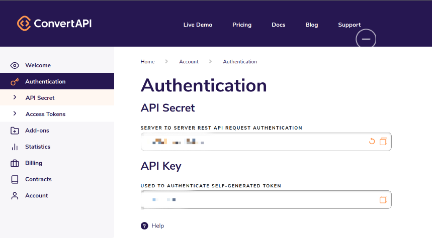
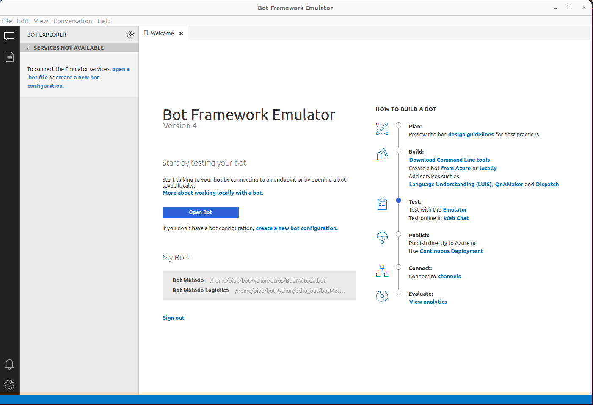
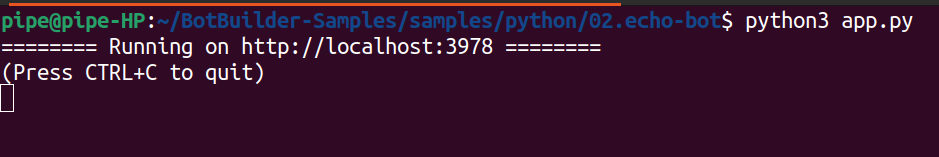
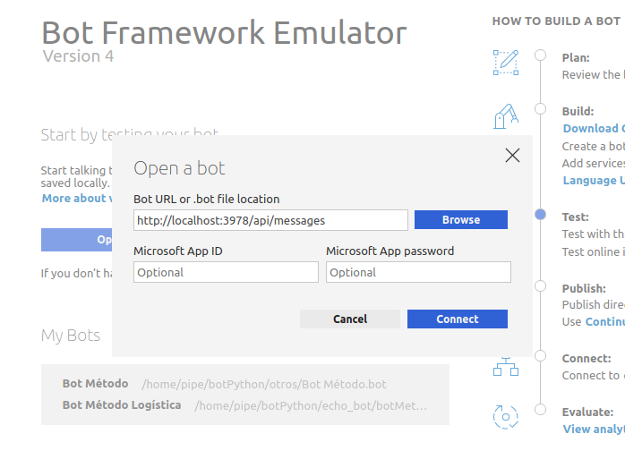
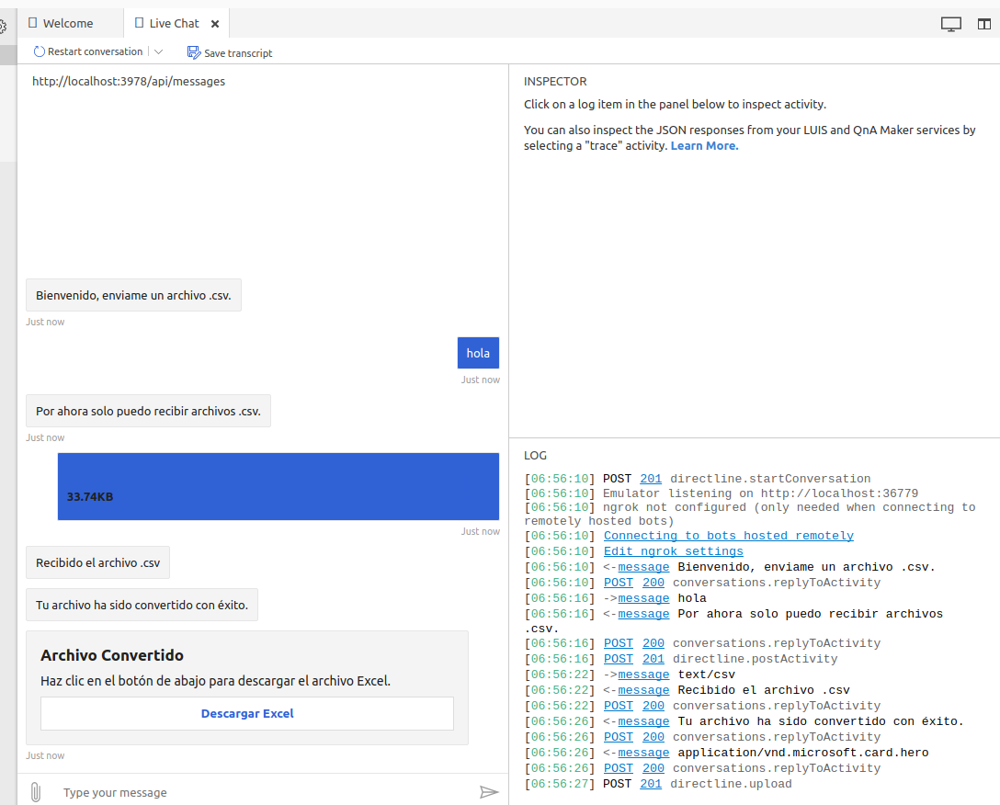

# Creation

## Overview
This bot is designed to facilitate the conversion of .csv files to .xlsx with a single click, integrating directly into the Microsoft Teams environment.

## Prerequisites
1. **Python**: You will need Python 3.10 or higher to run the bot. You can download it from [python.org](https://www.python.org/downloads/).

2. **Microsoft Teams**: You must have access to Microsoft Teams, where the bot will be integrated and used. You can sign in from [microsoft-teams.com](https://www.microsoft.com/en-us/microsoft-teams/log-in)

3. **ConvertAPI**: This API is used to quickly convert CSV files to Excel. You can sign up at [convertapi.com](https://www.convertapi.com/csv-to-xlsx#snippet=python)

4. **Echo Bot**: The `Echo Bot` is an example bot from the `Microsoft Bot Framework` that serves as a starting point for building the bot.

5. **Bot Framework Emulator**: Necessary for locally testing your bot and ensuring smooth user interactions. You can download it from [Bot Framework Emulator](https://github.com/Microsoft/BotFramework-Emulator/releases/tag/v4.3.3)

6. **Azure**: Azure is used to host the bot. You can sign up at [azure.com](https://azure.microsoft.com/en-us/)

7. **Developer Portal**: You will use Microsoft's Developer Portal to manage and deploy your bot application in Teams.


## Installation

### ConvertAPI

- Go to [convertapi.com](https://www.convertapi.com/csv-to-xlsx#snippet=python), register, and navigate to Profile>Authentication and copy your API Secret (you will need it in the next step).

### Echo Bot

- Clone the Microsoft BotBuilder Samples repository with the following command:

```
git clone https://github.com/microsoft/BotBuilder-Samples.git
```

```
cd BotBuilder-Samples/samples/python/02.echo-bot
```

- Copy the following content into the `requirements.txt` file:

```
aiohttp
python-dotenv
botbuilder-core
botbuilder-schema
convertapi
```

- Install the libraries with:

```
pip install -r requirements.txt
```

- Create a .env file with the variable `API_SECRET` and assign the API from `convertapi.com`


Example:

``` 
API_SECRET=123 
```

- Open file `echo_bot.py`
- The code to replace already contains the use of `API_SECRET` for the environment variable
- Replace its content with the following:

#### Code to Replace
```python
from botbuilder.core import ActivityHandler, TurnContext, MessageFactory
from botbuilder.schema import AttachmentData, ChannelAccount, Attachment, CardAction, ActionTypes, HeroCard
from dotenv import load_dotenv
import os
import aiohttp
import convertapi
load_dotenv()

# Configura tu clave secreta de ConvertAPI
convertapi.api_secret = os.getenv("API_SECRET")

class MyBot(ActivityHandler):

    async def on_message_activity(self, turn_context: TurnContext):
        print("on_message_activity")
        if turn_context.activity.attachments and len(turn_context.activity.attachments) > 0:
            attachment = turn_context.activity.attachments[0]
            if attachment.content_type == "text/csv":
                await turn_context.send_activity("Recibido el archivo .csv")
                await self.process_csv_attachment(attachment, turn_context)
            else:
                await turn_context.send_activity("Por favor, envíame un archivo .csv.")
        else:
            await turn_context.send_activity("Por ahora solo puedo recibir archivos .csv.")

    async def convert_csv_to_xlsx(self, local_csv_path):
        print("convert_csv_to_xlsx")
        # Hacer la solicitud a ConvertAPI y obtener el resultado
        conversion_result = convertapi.convert(
            'xlsx', {
                'File': local_csv_path,
                'Delimiter': ','
            },
            from_format='csv'
        )
        
        print("Archivo convertido: " + conversion_result.file.url)
        return conversion_result.file.url

    async def download_file(self, url):
        print("download_file")
        async with aiohttp  .ClientSession() as session:
            async with session.get(url) as response:
                if response.status == 200:
                    file_path = 'downloads/' + url.split('/')[-1]
                    with open(file_path, 'wb') as f:
                        f.write(await response.read())
                    return file_path

    async def _download_attachment_and_save(self, attachment: AttachmentData):
        print("_download_attachment_and_save")
        # Comprobar si el directorio de descargas existe, si no, crearlo
        download_folder = "downloads"
        if not os.path.exists(download_folder):
            os.makedirs(download_folder)

        # Extraer el nombre del archivo del URL
        file_name = attachment.name if attachment.name else attachment.content_url.split("/")[-1]
        file_path = os.path.join(download_folder, file_name)

        # Descargar el archivo
        async with aiohttp.ClientSession() as session:
            async with session.get(attachment.content_url) as response:
                if response.status == 200:
                    with open(file_path, "wb") as file:
                        file.write(await response.read())

        return file_path

    async def _send_excel_file(self, turn_context: TurnContext, file_url: str, file_name: str):
        # Crear una tarjeta con un botón de descarga
        print("_send_excel_file")
        card = HeroCard(
            title="Archivo Convertido",
            subtitle="Haz clic en el botón de abajo para descargar el archivo Excel.",
            buttons=[CardAction(
                type=ActionTypes.open_url,
                title="Descargar Excel",
                value=file_url
            )]
        )

        attachment = Attachment(
            content_type="application/vnd.microsoft.card.hero",
            content=card
        )

        await turn_context.send_activity(MessageFactory.attachment(attachment))

    async def on_members_added_activity(self, members_added: ChannelAccount, turn_context: TurnContext):
        print("on_members_added_activity")
        for member_added in members_added:
            if member_added.id != turn_context.activity.recipient.id:
                await turn_context.send_activity("Bienvenido, enviame un archivo .csv.")

    async def process_csv_attachment(self, attachment: AttachmentData, turn_context: TurnContext):
        print("process_csv_attachment")

        local_csv_path = await self._download_attachment_and_save(attachment)
        xlsx_url = await self.convert_csv_to_xlsx(local_csv_path)
        print("Archivo convertido: " + xlsx_url)

        if xlsx_url:
            local_xlsx_path = await self.download_file(xlsx_url)
            await turn_context.send_activity("Tu archivo ha sido convertido con éxito.")
            await self._send_excel_file(turn_context, xlsx_url, "converted.xlsx")
        else:
            await turn_context.send_activity("Hubo un problema al convertir el archivo, intenta de nuevo.")
```

### Bot Framework Emulator

Download the version that suits your operating system from the [Bot Framework Emulator](https://github.com/Microsoft/BotFramework-Emulator/releases/tag/v4.3.3) site.

To work with the Bot Framework Emulator on different operating systems, follow the specific instructions for each one.

#### Windows

- Run the installer and follow the instructions.
***

#### Ubuntu
Give execution permissions

```
chmod 700 BotFramework-Emulator-4.3.3-linux-x86_64.AppImage
```

Run Bot Framework Emulator

```
./BotFramework-Emulator-4.3.3-linux-x86_64.AppImage &
```

***

#### Mac
1. Once downloaded, locate the `.dmg` file in your downloads folder and open it with a double click.
2. Drag the Bot Framework Emulator icon to your Applications folder to install it.
3. Open the emulator from the Applications folder.

***

Once open, you will see a screen like this:


### Running Bot Framework Emulator

- Click on `Open Bot`


- Now go back to our `echo bot`. Navigate to the folder `BotBuilder-Samples/samples/python/02.echo-bot`
and run the bot with the following command:

```
python3 app.py
```

Once executed, you will see a screen like this:



- Return to `Bot Framework Emulator` and in Bot URL, enter the previous URL with the indicated suffix and Connect.



- Once connected, you can now interact with the Bot locally.



