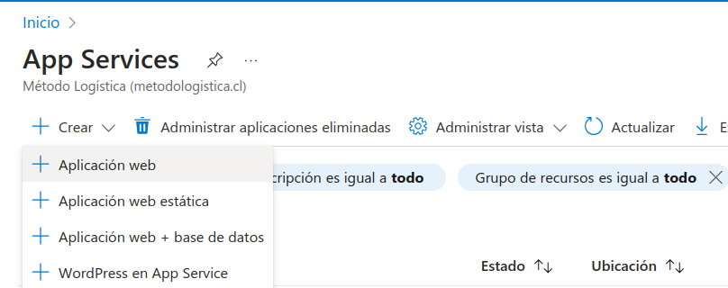
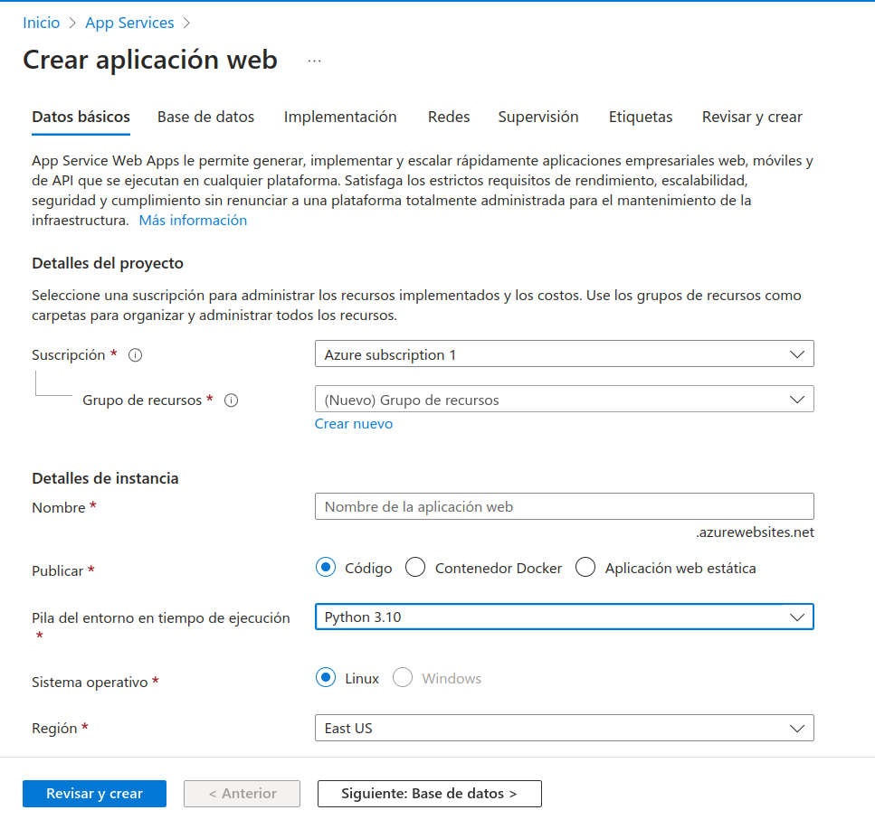
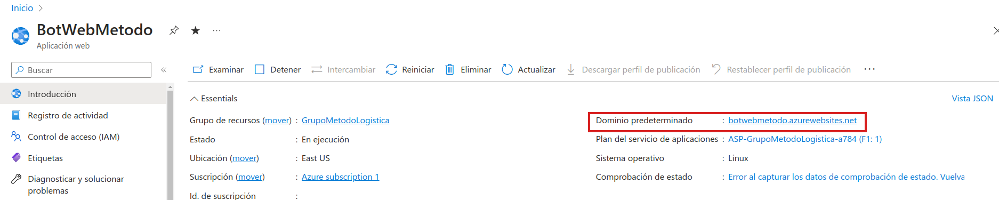
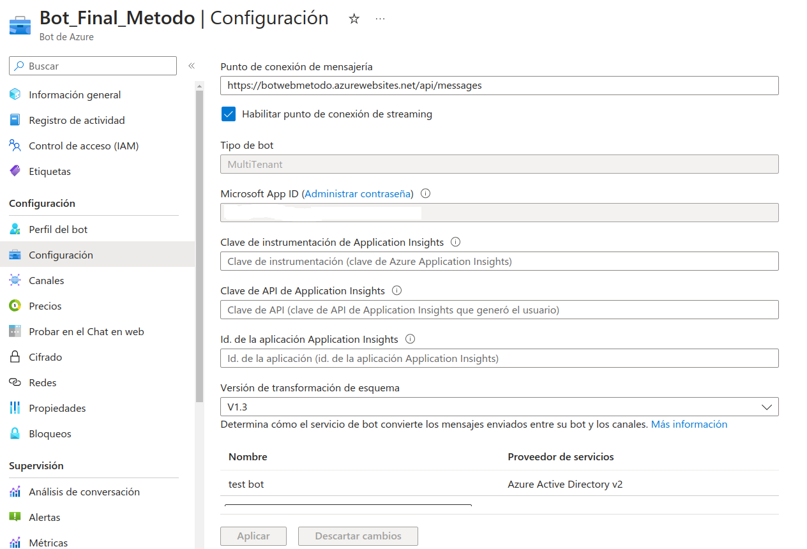
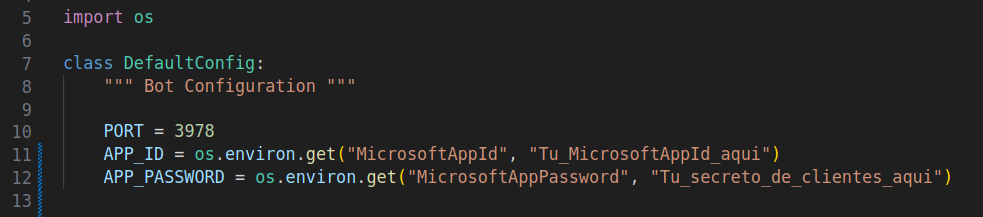
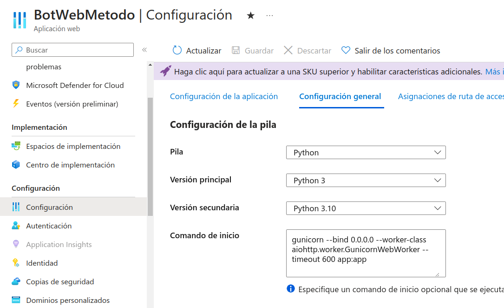

# Implementation

## Overview

Implementing our bot in the production environment involves several key steps that ensure proper integration and operation within Microsoft Teams. This process includes setting up our bot in Azure, preparing a web application to host the bot on Azure, making the necessary configurations, and finally, deploying and managing the bot through the Microsoft Developer Portal. The steps are outlined in broad terms below for a successful deployment:

1. **Configuration in Azure**: Create and configure the Azure Bot Service that will facilitate communication between the bot and Microsoft Teams.
2. **Preparation of the Web Application**: Deploy a web application that will act as the endpoint for our bot.
3. **Final Adjustments**: Make configuration adjustments to the web application to ensure the bot's correct functionality.
4. **Deployment with Developer Portal**: Use the Developer Portal to deploy the bot in Microsoft Teams, establishing the necessary connections and permission settings.

In the following sections, you will find a step-by-step guide to carry out each of these processes.

***

### Microsoft Registration 
[Microsoft Registration](https://learn.microsoft.com/en-us/microsoftteams/platform/sbs-file-handling-in-bot?tabs=ngrok%2Cvisualstudio&tutorial-step=3)
This registration provides you with an application ID and a secret that are necessary for configuring authentication and allowing your bot to communicate securely with Azure and Microsoft Teams services.

***

### Create Azure Bot 
[Bot Creation](https://learn.microsoft.com/en-us/microsoftteams/platform/sbs-file-handling-in-bot?tabs=ngrok%2Cvisualstudio&tutorial-step=4)
Set up an Azure Bot Service to integrate your bot developed in Python.

***

#### Follow the instructions to create a web application to store your Azure Bot

1. Go to App Services > Create > Web Application

  

2. 
- **Resource group** use the same as the Azure Bot.
- **Name** optional.
- **Publish** Code.
- **Runtime stack** > Python 3.10 .
- **Review and create**

 

- Enter the Resource > **Quickstart**
- Copy the **Default Domain** of the Web Application



- Paste it **within the Bot** Configuration > Settings > Messaging endpoint with the suffix `/api/messages`.
- **Enable** the streaming endpoint.



- You should already have your *Client Secrets*, if not click on **Manage password** and create it.


- Paste them inside your *echo bot* in the **config.py** file



- Within the *Web Application* go to Configuration > Settings and in **Startup Command** paste the command.

```
gunicorn --bind 0.0.0.0 --worker-class aiohttp.worker.GunicornWebWorker --timeout 600 app:app
```

- Enter the configuration from the image and save.


