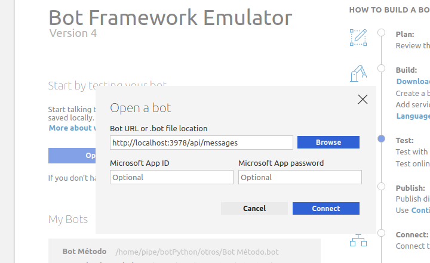
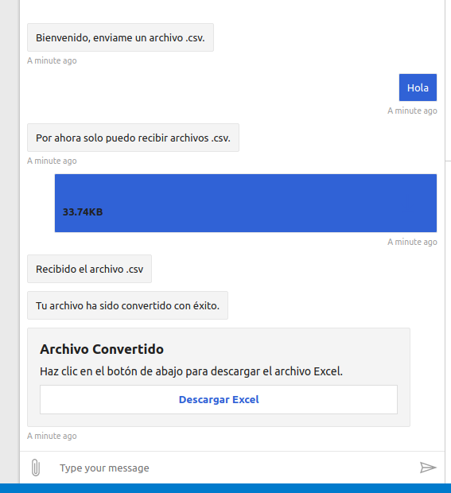
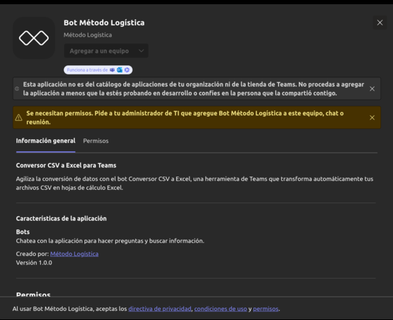

# Despliegue

### Despliegue del Bot en Azure

Para desplegar tu bot en Azure utilizando Visual Studio Code, sigue estos pasos:

1. **Instalación de la Extensión Azure Tools**  
    Abre Visual Studio Code y asegúrate de instalar la extensión 'Azure Tools'.  
    Inicia sesión con tu cuenta de Azure.

2. **Despliegue del Bot**  
    Haz clic en el icono de la extensión Azure en Visual Studio Code. Esto mostrará una estructura de archivos en el panel lateral.  
    Navega a App Services y localiza tu bot.   
    Haz clic derecho sobre el nombre de tu bot y selecciona la opción "Deploy to Web App...". Confirma el despliegue cuando se te solicite.  

3. **Espera el Proceso de Despliegue**  
    Espera a que el proceso de despliegue se complete. Puedes seguir el progreso en la salida de Visual Studio Code.
    Una vez finalizado, se mostrará un mensaje de confirmación de que el despliegue ha sido exitoso.  

4. **Verificación**  
    Verifica que tu bot esté funcionando correctamente accediendo a la URL proporcionada tras el despliegue.

### Prueba del Bot
- Ahora que ya tienes listo el Registro y el Bot, probamos el Bot con credenciales de Azure. Para ello deberás guardar el MicrosoftAppId y MicrosoftPasswordId (Secretos de los Cliente) e ingresarlos en **Bot Framework Emulator**.

- Para ello manten ejecutando `python3 app.py`

- Abre **Bot Framework Emulator** con `./BotFramework-Emulator-4.3.3-linux-x86_64.AppImage &`
- Ingresa la URL de la imagen con el sufijo `/api/messages`
- Ingresa tu *Microsoft App ID* y *Microsoft App password* 
- **Conectar**.

- Ya puedes interacuar con el Bot.

***

### Cargar el Bot en Microsoft Teams  
    Para añadir tu bot desarrollado en Azure a Microsoft Teams, sigue estos pasos:

1. **Utiliza las Herramientas para Desarrolladores en Microsoft Teams**  
    Asegúrate de tener la aplicación "Developer tools" instalada en Microsoft Teams.  

2. **Crear una Nueva Aplicación**  
    En Microsoft Teams, ve a "Aplicaciones" y selecciona "New App".  
    Rellena la información requerida de la aplicación, como nombre, descripción, icono, entre otros.  

3. **Configurar el Bot**  
    Dirígete a la sección "Configure > App Features > Bot".  
    En "Enter a Bot ID", ingresa tu MicrosoftAppId.  
    En "What can your bot do?", selecciona "Upload and download files".  
    En "Select the scopes", elige "Team" para definir el alcance en el que las personas pueden usar este comando.  

4. **Establecer Permisos de la Aplicación**  
    Navega a "Configure > Permissions".  
    Selecciona "Device permissions: open links in external apps".  
    Haz clic en "Preview in Teams" para ver una vista previa del bot en Teams.  

5. **Solicitar Permisos del Administrador**  
    Al hacer clic en "Preview in Teams", aparecerá una pestaña solicitando los permisos del administrador para aprobar tu bot.

Una vez que el administrador apruebe tu bot, podrás usarlo libremente.  