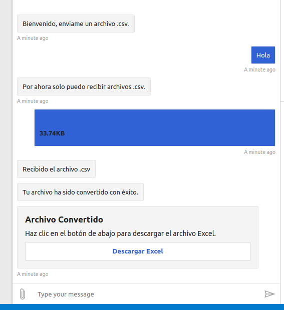
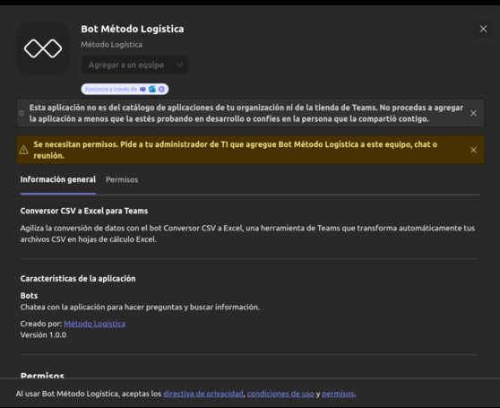

# Deployment

### Bot Deployment on Azure

To deploy your bot on Azure using Visual Studio Code, follow these steps:

1. **Installation of Azure Tools Extension**  
    Open Visual Studio Code and make sure to install the 'Azure Tools' extension.  
    Sign in with your Azure account.

2. **Bot Deployment**  
    Click on the Azure extension icon in Visual Studio Code. This will display a file structure in the sidebar.  
    Navigate to App Services and locate your bot.  
    Right-click on the name of your bot and select the "Deploy to Web App..." option. Confirm the deployment when prompted.  

3. **Wait for Deployment Process**  
    Wait for the deployment process to complete. You can follow the progress in the output of Visual Studio Code.
    Once finished, a confirmation message will be displayed that the deployment has been successful.  

4. **Verification**  
    Verify that your bot is working correctly by accessing the URL provided after deployment.

### Bot Testing
- Now that you have the Registration and Bot ready, test the Bot with Azure credentials. For this, you should save the MicrosoftAppId and MicrosoftPasswordId (Client Secrets) and enter them in **Bot Framework Emulator**.

- For this keep running `python3 app.py`

- Open **Bot Framework Emulator** with `./BotFramework-Emulator-4.3.3-linux-x86_64.AppImage &`
- Enter the URL from the image with the suffix `/api/messages`
- Enter your *Microsoft App ID* and *Microsoft App password* 
- **Connect**.

- Now you can interact with the Bot.

***

### Loading the Bot in Microsoft Teams  
    To add your bot developed on Azure to Microsoft Teams, follow these steps:

1. **Use Developer Tools in Microsoft Teams**  
    Make sure you have the "Developer tools" application installed in Microsoft Teams.  

2. **Create a New Application**  
    In Microsoft Teams, go to "Apps" and select "New App".  
    Fill in the required application information such as name, description, icon, and others.  

3. **Configure the Bot**  
    Go to the "Configure > App Features > Bot" section.  
    In "Enter a Bot ID", enter your MicrosoftAppId.  
    In "What can your bot do?", select "Upload and download files".  
    In "Select the scopes", choose "Team" to define the scope in which people can use this command.  

4. **Set Application Permissions**  
    Navigate to "Configure > Permissions".  
    Select "Device permissions: open links in external apps".  
    Click on "Preview in Teams" to preview the bot in Teams.  

5. **Request Administrator Permissions**  
    When you click on "Preview in Teams", a tab will appear requesting the administrator's permissions to approve your bot.

Once the administrator approves your bot, you will be able to use it freely.