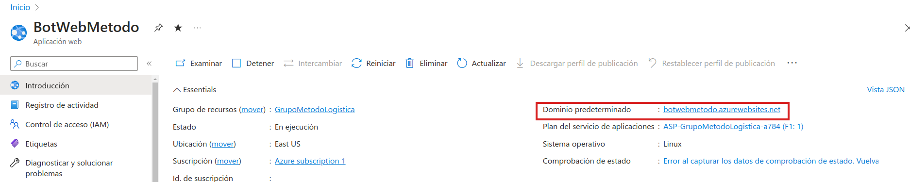
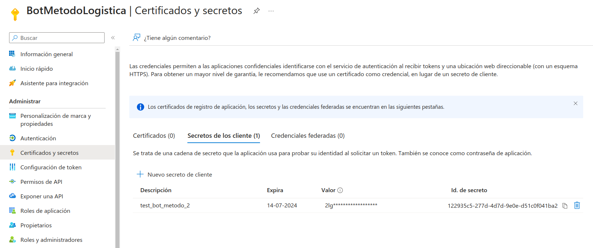
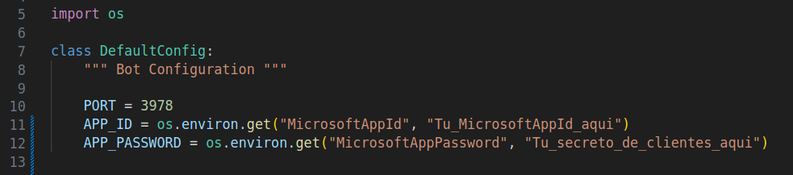
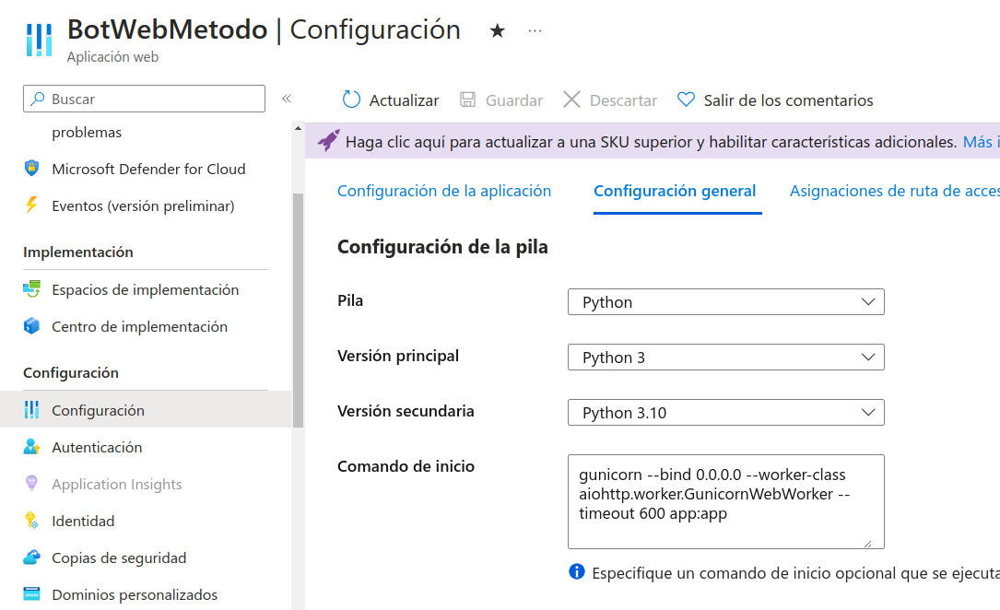

# Implementación

## Descripción General   

La implementación de nuestro bot en el entorno de producción implica varios pasos clave que garantizan una integración y funcionamiento correctos dentro de Microsoft Teams. Este proceso incluye la configuración de nuestro bot en Azure, la preparación de una aplicación web para almacenar el bot en azure, realizar las configuraciones necesarias y, finalmente, desplegar y gestionar el bot a través del Developer Portal de Microsoft. A continuación, se detallan los pasos a grandes rasgos para lograr un despliegue exitoso:

1. **Configuración en Azure**: Crear y configurar el servicio Azure Bot que facilitará la comunicación entre el bot y Microsoft Teams.
2. **Preparación de la Aplicación Web**: Desplegar una aplicación web que actuará como el punto de conexión para nuestro bot.
3. **Ajustes Finales**: Realizar ajustes de configuración en la aplicación web para asegurar la correcta funcionalidad del bot.
4. **Despliegue con el Developer Portal**: Utilizar el Developer Portal para desplegar el bot en Microsoft Teams, estableciendo las conexiones necesarias y ajustes de permisos.

En las siguientes secciones, encontrarás una guía paso a paso para llevar a cabo cada uno de estos procesos.

***

### Registro de Microsoft 
[Registro de Microsoft](https://learn.microsoft.com/es-es/microsoftteams/platform/sbs-file-handling-in-bot?tabs=ngrok%2Cvisualstudio&tutorial-step=3)
Este registro te proporciona un ID de aplicación y un secreto que son necesarios para configurar la autenticación y permitir que tu bot se comunique de forma segura con los servicios de Azure y Microsoft Teams.

***

### Crear azure Bot 
[Creación del Bot](https://learn.microsoft.com/es-es/microsoftteams/platform/sbs-file-handling-in-bot?tabs=ngrok%2Cvisualstudio&tutorial-step=4)
Configura un servicio Azure Bot para integrar tu bot desarrollado en Python.

***

#### Sigue las instrucciones para crear una aplicacion web con el fin de almacenar tu Azure Bot

1. Dirigete a App Services > Crear > Aplicación web

  

2. 
- **Grupo de recursos** utiliza el mismo del azure bot.
- **Nombre** opcional.
- **Publicar**  Código.
- **Pila del entorno en tiempo de ejecución** > Python3.10 .
-  **Revisar y Crear**

 

- Ingresar al Recurso > **Introducción**
- Copiar el **Dominio predeterminado** de la Aplicación Web



- Pegalo **dentro del Bot** Configuración > configuración > Punto de conexión de mensajeria con el  sufijo `/api/messages`.
- **Habilita** el punto de conexión de streaming.


- Ya deberías tener tu *Secretos de cliente*, si no lo tienes haz click en **Administrar contraseña** y crealo.



- Pegalos dentro de tu *echo bot* en el archivo **config.py**



- Dentro de la *Aplicación Web* ve a Configuración > configuración y en **Comando de inicio** y pega el comando.
```
gunicorn --bind 0.0.0.0 --worker-class aiohttp.worker.GunicornWebWorker --timeout 600 app:app
```
- Ingresa la configuración de la imagen y guarda.



